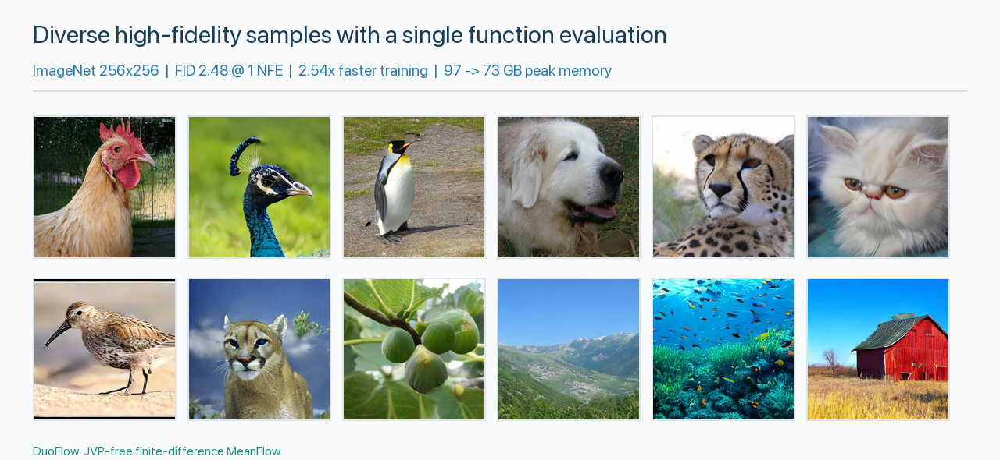

# DuoFlow: JVP-Free Finite-Difference Mean Flows for One-Step Image Generation

Implementation of **DuoFlow**, an ECCV 2026 method that removes the expensive
Jacobian-vector product (JVP) from MeanFlow training. DuoFlow uses a stochastic
signed finite-difference estimator, same-state joint velocity estimation, and
progressive self-bootstrapping to make one-step image generation practical.




- **High-quality one-step generation.** The poster's sample strip shows diverse, high-fidelity images generated by ImageNet 256x256 models trained from scratch with a single function evaluation. DuoFlow-XL/2 reaches **FID 2.48 at 1 NFE**, improving over the matched MeanFlow baseline by **27.7%**. 
- **Efficient training without JVP transforms.** Directional-derivative evaluation is **7.17x--34.83x faster**, while the peak-memory ratio favors DuoFlow by **1.71x--2.68x**, depending on batch size. In the matched XL/2 experiment, end-to-end training improves from **0.89 to 0.35 s/iter (2.54x faster)** while peak memory drops from **97 GB to 73 GB** on 8 NVIDIA H800 GPUs.


## Results

| Model | Training epochs | FID (1 NFE) |
| --- | ---: | ---: |
| MeanFlow SiT-B/4 | 80 | 15.53 |
| DuoFlow SiT-B/4 | 80  | ~9.2  |
| MeanFlow SiT-XL/2 | 240 | 3.43 |
| DuoFlow SiT-XL/2 | 240 | ~2.5 |

> It is worth noting that `DuoFlow SiT-B/4` 80e training can be completed within **2 hours** (testing our 8xH800 GPUs).

All reported ImageNet models are trained from scratch on 256x256 images.
## Environment

We use [`uv`](https://docs.astral.sh/uv/) to manage the Python environment.
Install `uv`, then run:

```bash
# Set up the Python environment.
make install
source .venv/bin/activate

# Download the FID reference statistics.
mkdir -p data
curl -L https://raw.githubusercontent.com/zhuyu-cs/MeanFlow/main/fid_stats/adm_in256_stats.npz \
  -o ./data/adm_in256_stats.npz
```

## Evaluation

If FID evaluation raises a NumPy dtype error, open
`.venv/lib/python3.10/site-packages/torch_fidelity/metric_fid.py` and add these
four lines immediately after the `mu1, sigma1` assignment(line 35):

```diff
34a35,39
>     mu1 = mu1.astype(np.float64)
>     mu2 = mu2.astype(np.float64)
>     sigma1 = sigma1.astype(np.float64)
>     sigma2 = sigma2.astype(np.float64)
```

Evaluate the SiT-B/4 checkpoint with two GPUs:

```bash
accelerate launch --num_processes 2 \
  duoflow/duoflow_b4_1024b_exp.py \
  mode=val \
  module_cfg.ckpt_path="hf://zengarden/DuoFlow/sit-b4/model.safetensors" \
  dataloader_cfg.val_batch_size_per_device=32
```
The SiT-B/4 command should produce approximately **9.2 FID** in the one-step setting.

Evaluate the SiT-XL/2 checkpoint with two GPUs:

```bash
accelerate launch --num_processes 2 \
  duoflow/duoflow_b4_1024b_exp.py \
  mode=val \
  module_cfg.name="SiT-XL/2" \
  module_cfg.ckpt_path="hf://zengarden/DuoFlow/sit-xl2/model.safetensors" \
  dataloader_cfg.val_batch_size_per_device=4
```

The SiT-XL/2 command should produce approximately **2.5 FID** in the one-step setting.

## Training

DuoFlow avoids JVP transforms and stays within standard forward/backward
execution. The poster reports a **2.54x end-to-end training speedup** and a
substantially smaller memory footprint than the JVP-based MeanFlow baseline.

### 1. Prepare ImageNet

We follow [MeanFlow](https://github.com/zhuyu-cs/MeanFlow) to prepare the data.

Download [ImageNet ILSVRC2012](https://image-net.org/challenges/LSVRC/2012/)
and arrange the files as follows:

```text
./data/imagenet/
└── train/
    ├── n01440764/
    │   ├── n01440764_10026.JPEG
    │   └── ...
    ├── n01443537/
    └── ...  (1000 class folders)
```

### 2. Convert ImageNet to LMDB

```bash
python ./preprocess_imagenet/image2lmdb.py
```

### 3. Encode images as VAE latents

```bash
torchrun --nproc_per_node=8 --nnodes=1 --node_rank=0 \
  ./preprocess_imagenet/main_cache.py \
  --source_lmdb ./data/imagenet_train.lmdb \
  --target_lmdb ./data/imagenet/train_vae_latents_lmdb \
  --img_size 256 \
  --batch_size 1024 \
  --lmdb_size_gb 400
```

### 4. Train DuoFlow

The first epoch can be slower because the dataset cache is populated during
that epoch.

```bash
tinyexp-run-with-redis -- accelerate launch --num_processes 8 \
  duoflow/duoflow_b4_1024b_exp.py \
  wandb_cfg.enable_wandb=False
```


# 7. Acknowledgments

We would like to thank the following projects: [MeanFlow](https://github.com/zhuyu-cs/MeanFlow), [JaxMeanFlow](https://github.com/Gsunshine/meanflow) for providing helpful codebase. 